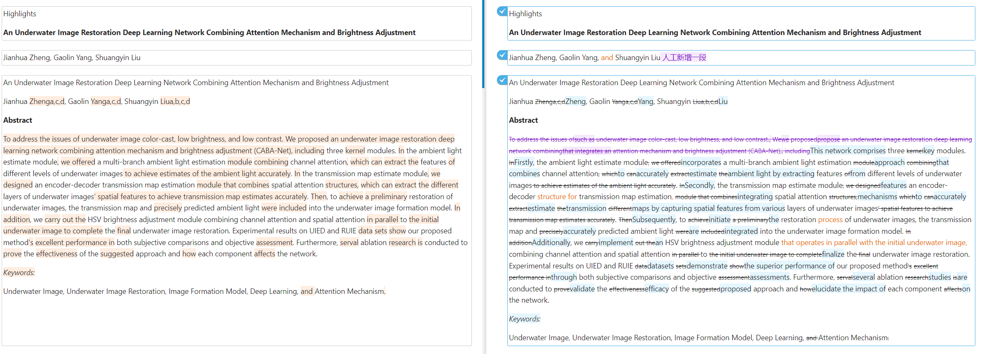
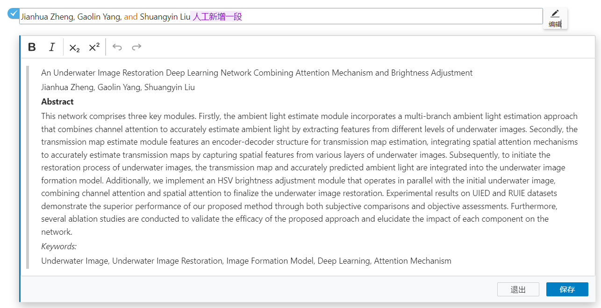

---

# HtmlDiff

## 概述

HtmlDiff 是一个强大的工具，用于实现 HTML 的差异化和对比。通过该工具，您可以轻松地将两个 HTML 文档之间的变化可视化，特别是增删改等差异部分，使用不同颜色进行高亮显示。

## 功能特性

- **差异化展示：** 插件对所有变化（包括新增、删除和修改）进行颜色区分，使得用户可以一目了然地识别出差异部分。

  

- **人工编辑区分：** 通过不同的颜色来区分 AI 润色与人工编辑的内容，便于更加精确的内容审核和修改。

  
  - 编辑段落定位
  - 复制粘贴不会携带样式
  - 搜索一键替换
  - 编辑的时候同样携带差异化样式

## 使用方法

1. 安装 HtmlDiff 插件。
2. 通过插件接口传入两个 HTML 文档，插件会自动生成对比结果。
3. 查看生成的对比结果，插件会使用不同颜色高亮显示增删改部分。

## 示例

```html
<div>
  <!-- 原始内容 -->
  <p>这是一个例子。</p>

  <!-- 修改后内容 -->
  <p>这是一个<strong>简单</strong>的例子。</p>
</div>
```

在上述示例中，HtmlDiff 将高亮显示 `<strong>简单</strong>` 作为新增内容，并显示与原始内容的区别。

